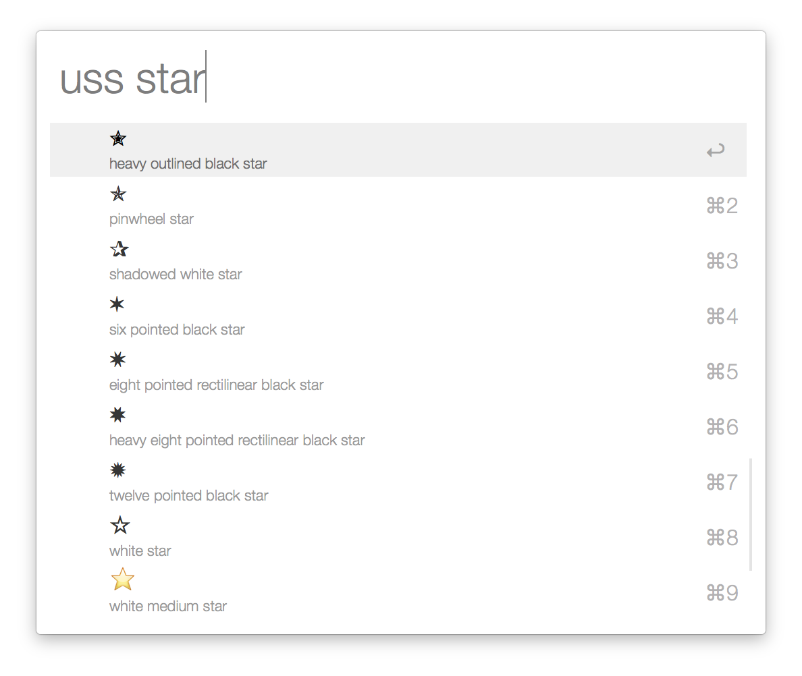
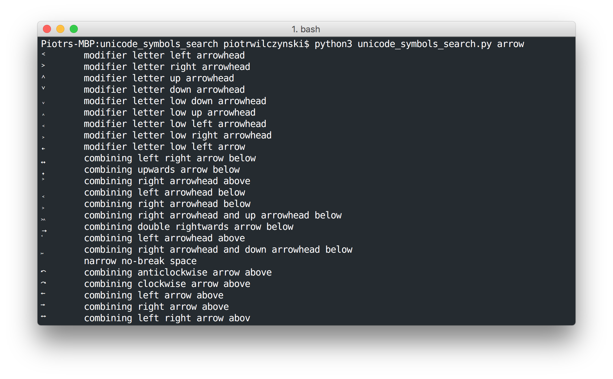

Find and paste unicode symbols using python script or alfred workflow. 

If you like this workflow maybe you will also like my app on the iOS that basically does the same thing:

### [Symbolay](http://symbolay.com)

