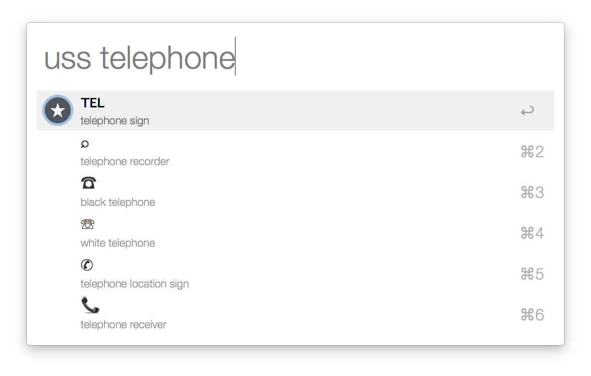

Find and paste unicode symbols using python script or alfred2 workflow.

If you like this workflow maybe you will like my app on the iPhone and iPad that has similar features:

[Symbolay](http://symbolay.com)

